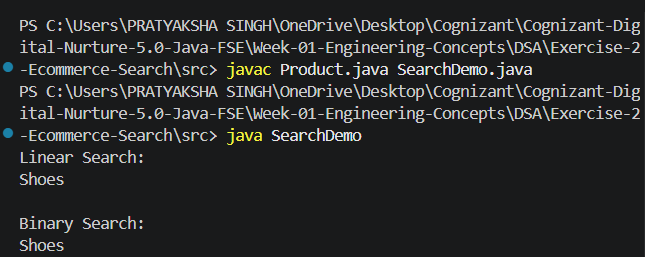

# Exercise 2 - E-commerce Platform Search Function

## Objective

Implement Linear Search and Binary Search for product searching in an e-commerce platform.

## Algorithms Used

### Linear Search

- Traverses elements one by one.
- Works on unsorted data.
- Time Complexity: O(n)

### Binary Search

- Requires sorted data.
- Repeatedly divides search space.
- Time Complexity: O(log n)

## Output

## Conclusion

Binary Search is more efficient for large datasets because it reduces the search space by half during each iteration.