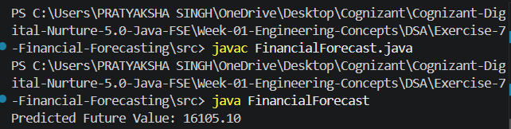

# Exercise 7 - Financial Forecasting

## Objective

Predict future financial values using recursion.

## Concept Used

### Recursion

A recursive function repeatedly calls itself until a base condition is reached.

## Formula

Future Value = Present Value × (1 + Growth Rate)^Years

## Output

## Time Complexity

O(n)

where n is the number of years.

## Optimization

For very large inputs, Dynamic Programming or Memoization can be used to reduce repeated computations.