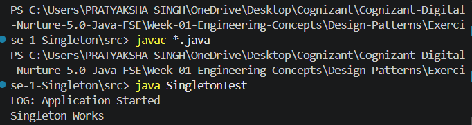

# Exercise 1 - Singleton Pattern

## Objective

Implement the Singleton Design Pattern to ensure that only one instance of a Logger class exists throughout the application lifecycle.

## Scenario

A logging utility should maintain a single instance across the application to ensure consistent logging behavior and centralized logging throughout the application.


## Project Structure

```text
Exercise-1-Singleton
│
├── src
│   ├── Logger.java
│   └── SingletonTest.java
│
├── output.png
└── README.md
```


## Implementation Details

### Logger Class

- Private static instance variable.
- Private constructor to prevent external object creation.
- Public static `getInstance()` method to provide access to the single instance.
- `log()` method for logging messages.

### Test Class

- Retrieves Logger instance multiple times.
- Verifies that only one object is created.
- Demonstrates Singleton behavior.


## Output



### Console Output

```text
LOG: Application Started
Singleton Works
```

## Learning Outcome

- Understanding Singleton Design Pattern
- Restricting object creation
- Providing global access to an object
- Improving resource management and consistency


## Author

Pratyaksha Singh
Cognizant Digital Nurture 5.0 - Java FSE