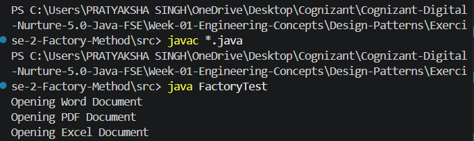

# Exercise 2 - Factory Method Pattern

## Objective

Implement the Factory Method Design Pattern to create different types of documents in a document management system.

## Scenario

The system should support multiple document types such as Word, PDF, and Excel while keeping object creation separate from the client code.

---

## Project Structure

```text
Exercise-2-Factory-Method
│
├── src
│   ├── Document.java
│   ├── WordDocument.java
│   ├── PdfDocument.java
│   ├── ExcelDocument.java
│   ├── DocumentFactory.java
│   ├── WordFactory.java
│   ├── PdfFactory.java
│   ├── ExcelFactory.java
│   └── FactoryTest.java
│
├── output.png
└── README.md
```

---

## Implementation Details

### Document Interface

Defines a common method:

```java
void open();
```

### Concrete Document Classes

- WordDocument
- PdfDocument
- ExcelDocument

Each class implements the Document interface.

### Factory Classes

- WordFactory
- PdfFactory
- ExcelFactory

Each factory creates its corresponding document type.

### Client

FactoryTest demonstrates the creation and usage of different document types through factory objects.

---

## Output



### Console Output

```text
Opening Word Document
Opening PDF Document
Opening Excel Document
```

---

## Learning Outcome

- Understanding Factory Method Design Pattern
- Decoupling object creation from business logic
- Improving flexibility and maintainability
- Applying abstraction and polymorphism

---

## Author

Pratyaksha Singh
Cognizant Digital Nurture 5.0 - Java FSE