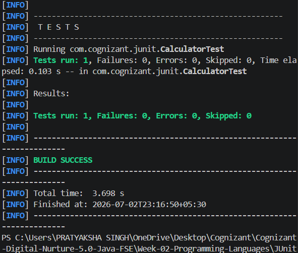
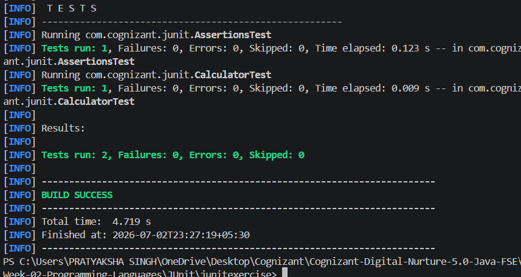
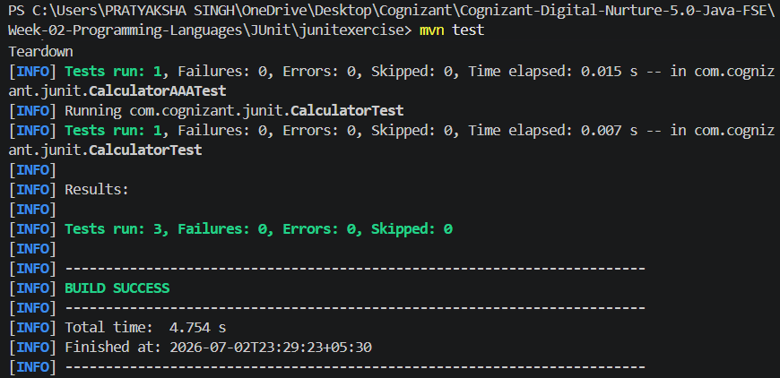

# Week 2 - JUnit Exercises

## Cognizant Digital Nurture 5.0 - Java FSE

This project contains the mandatory JUnit hands-on exercises for Week 2 of the Cognizant Digital Nurture 5.0 Java FSE Program.


## Technologies Used

- Java 25
- Apache Maven 3.9.16
- JUnit 5

# Exercise 1 - Setting Up JUnit

## Objective

Configure a Maven project with JUnit 5 and execute a basic unit test.

### Description

- Created a Maven project.
- Added JUnit 5 dependency.
- Configured the Maven Surefire Plugin.
- Wrote and executed a simple unit test.

### Output




# Exercise 3 - Assertions in JUnit

## Objective

Understand and use different assertion methods provided by JUnit.

### Assertions Covered

- `assertEquals()`
- `assertTrue()`
- `assertFalse()`
- `assertNull()`
- `assertNotNull()`

### Output




# Exercise 4 - Arrange-Act-Assert (AAA), Setup & Teardown

## Objective

Learn the Arrange-Act-Assert (AAA) testing pattern and the JUnit test lifecycle.

### Concepts Covered

- Arrange → Prepare test data
- Act → Execute the method
- Assert → Verify the result
- `@BeforeEach`
- `@AfterEach`

### Output




# Project Structure

```text
junitexercise
│
├── pom.xml
├── README.md
├── output1.png
├── output3.png
├── output4.png
│
└── src
    ├── main
    │   └── java
    │       └── com
    │           └── cognizant
    │               └── junit
    │                   └── Calculator.java
    │
    └── test
        └── java
            └── com
                └── cognizant
                    └── junit
                        ├── CalculatorTest.java
                        ├── AssertionsTest.java
                        └── CalculatorAAATest.java
```


# How to Run

Open a terminal inside the project directory and execute:

```bash
mvn test
```


# Expected Result

All test cases should execute successfully with:

- Tests Passed ✅
- Failures: 0
- Errors: 0
- BUILD SUCCESS


## Author

**Pratyaksha Singh**
Cognizant Digital Nurture 5.0 – Java FSE