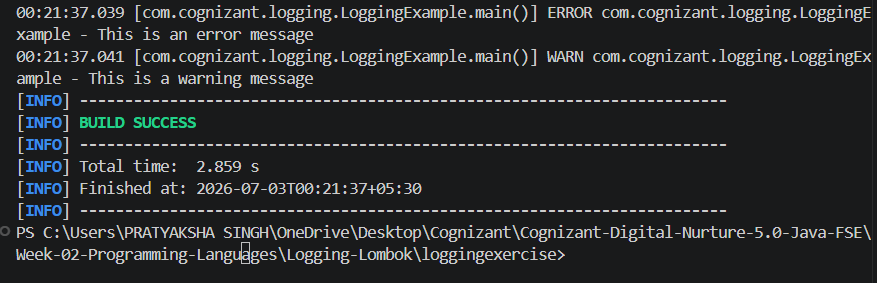

# Week 2 - Logging using SLF4J

## Cognizant Digital Nurture 5.0 - Java FSE

This project demonstrates the mandatory SLF4J logging exercise for Week 2.


## Exercise 1 - Logging Error Messages and Warning Levels

### Objective

Implement logging using the SLF4J logging framework with Logback.

### Technologies Used

- Java
- Maven
- SLF4J
- Logback

### Concepts Covered

- Logger
- LoggerFactory
- Error Level Logging
- Warning Level Logging

### Output




## Project Structure

```text
loggingexercise
│
├── pom.xml
├── README.md
├── output.png
│
└── src
    └── main
        └── java
            └── com
                └── cognizant
                    └── logging
                        └── LoggingExample.java
```


## Run

```bash
mvn compile
mvn exec:java -Dexec.mainClass="com.cognizant.logging.LoggingExample"
```


## Author

**Pratyaksha Singh**

Cognizant Digital Nurture 5.0 – Java FSE