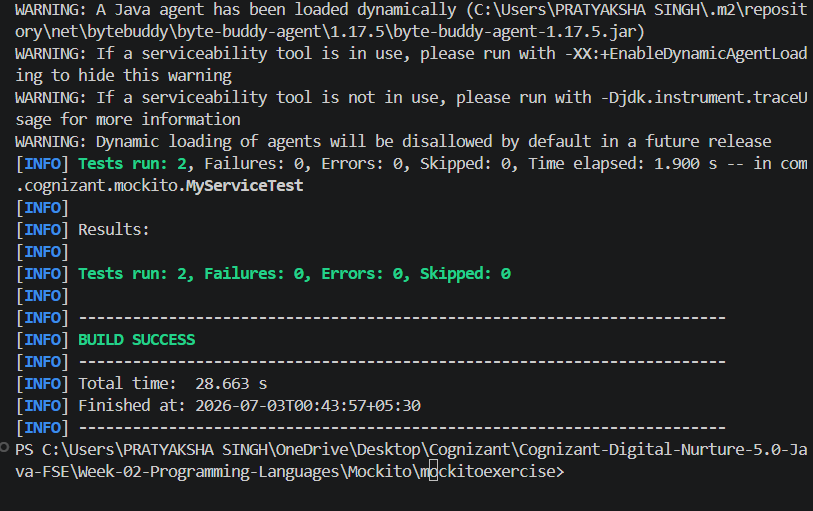

# Week 2 - Mockito Exercises

## Cognizant Digital Nurture 5.0 - Java FSE

This project contains the mandatory Mockito hands-on exercises for Week 2.


## Exercises Completed

### Exercise 1 - Mocking and Stubbing

**Objective**

Create a mock object, stub its behavior, and verify the returned value using Mockito.


### Exercise 2 - Verifying Interactions

**Objective**

Verify that the mocked object's method is invoked correctly using Mockito.

## Technologies Used

- Java 25
- Apache Maven
- JUnit 5
- Mockito


## Output




## Run

```bash
mvn test
```


## Result

Both Mockito test cases executed successfully without failures.


## Author

**Pratyaksha Singh**

Cognizant Digital Nurture 5.0 – Java FSE