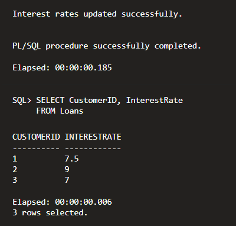
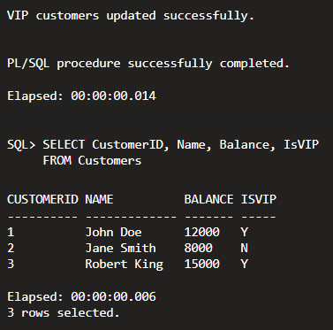
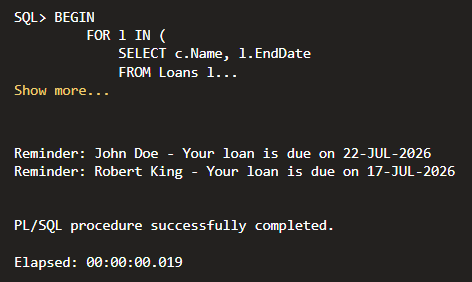

# Exercise 1 - Control Structures

This exercise demonstrates the use of PL/SQL control structures such as loops and conditional statements to solve banking-related scenarios.

## Scenario 1 - Loan Interest Discount

### Objective

Apply a **1% discount** to the loan interest rates of customers who are **older than 60 years**.

### Result

Successfully updated the loan interest rates for eligible customers.

## Scenario 2 - VIP Customer Identification

### Objective

Identify customers with an account balance greater than **10000** and mark them as **VIP**.

### Result

Eligible customers were successfully updated as VIP.

## Scenario 3 - Loan Due Reminder

### Objective

Display reminder messages for customers whose loan repayment is due within the next **30 days**.

### Result

Reminder messages were successfully displayed for eligible customers.

## Technologies Used

- Oracle SQL
- Oracle PL/SQL
- Oracle Live SQL

## Output

### Scenario 1

### Scenario 2

### Scenario 3

## Files Included

- Exercise1.sql
- README.md
- output.png

## Result

All three PL/SQL control structure scenarios executed successfully.