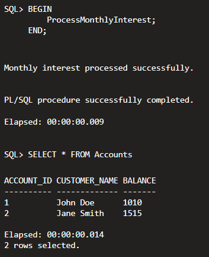

# Exercise 3 - Stored Procedures

## Objective

Implement a PL/SQL stored procedure to process monthly interest for bank accounts.

## Scenario

Create a stored procedure `ProcessMonthlyInterest` that applies a **1% monthly interest** to all account balances.

## Technologies Used

- Oracle SQL
- Oracle PL/SQL
- Oracle Live SQL

## Procedure Implemented

- Created the `ProcessMonthlyInterest` stored procedure.
- Updated account balances by applying a 1% interest rate.
- Executed the procedure successfully.
- Verified the updated balances.

## Output

## Result

The stored procedure executed successfully and updated all account balances by applying 1% monthly interest.