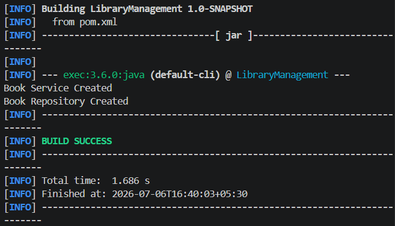

# Exercise 1 - Configuring a Basic Spring Application

## Objective
Configure a basic Spring Core application using XML-based configuration and verify bean creation through the Spring IoC container.

## Scenario
A library management system requires a backend application using the Spring Framework. This exercise demonstrates how to configure Spring beans using an XML configuration file and load them using the Spring Application Context.

## Tools & Technologies
- Java 17
- Spring Core 6.2.8
- Maven
- VS Code

## Project Structure

```
LibraryManagement
├── pom.xml
├── src
│   ├── main
│   │   ├── java
│   │   │   └── com.library
│   │   │       ├── LibraryManagementApplication.java
│   │   │       ├── repository
│   │   │       │   └── BookRepository.java
│   │   │       └── service
│   │   │           └── BookService.java
│   │   └── resources
│   │       └── applicationContext.xml
│   └── test
```

## Steps Performed

1. Created a Maven project named **LibraryManagement**.
2. Added the Spring Context dependency in `pom.xml`.
3. Created the `BookService` and `BookRepository` classes.
4. Configured Spring beans in `applicationContext.xml`.
5. Loaded the Spring Application Context using `ClassPathXmlApplicationContext`.
6. Retrieved the beans and verified successful execution.

## Output

```
Book Service Created
Book Repository Created
```



## Learning Outcome

- Understood the Maven project structure.
- Learned XML-based bean configuration in Spring.
- Learned how the Spring IoC container manages beans.
- Successfully loaded and accessed Spring beans using the Application Context.

## Author

**Pratyaksha Singh**

Cognizant Digital Nurture 5.0 – Java FSE