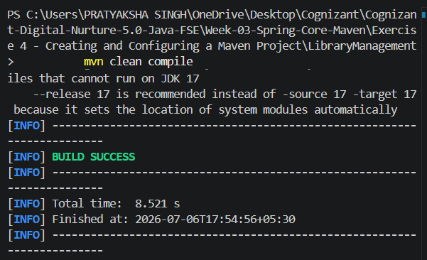

# Exercise 4 - Creating and Configuring a Maven Project

## Objective

Create and configure a Maven project for a Spring application by adding the required Spring dependencies and configuring the Maven Compiler Plugin.

## Scenario

A new Maven project is required for the Library Management application. The project should include the necessary Spring Framework dependencies and be configured to compile successfully using Maven.

## Tools & Technologies

- Java 17
- Maven
- Spring Context
- Spring AOP
- Spring Web MVC
- VS Code

## Project Structure

```
LibraryManagement
├── pom.xml
├── src
│   ├── main
│   └── test
```

## Steps Performed

1. Created a Maven project named **LibraryManagement**.
2. Configured project coordinates (`groupId`, `artifactId`, and `version`).
3. Added the following Spring dependencies:
   - Spring Context
   - Spring AOP
   - Spring Web MVC
4. Configured the Maven Compiler Plugin.
5. Built the project successfully using Maven.

## Build Command

```bash
mvn clean compile
```

## Output

```
BUILD SUCCESS
```



## Learning Outcome

- Learned Maven project creation.
- Understood the purpose of `pom.xml`.
- Added external dependencies using Maven.
- Configured the Maven Compiler Plugin.
- Successfully built a Maven project using the Maven lifecycle.

## Author

**Pratyaksha Singh**

Cognizant Digital Nurture 5.0 – Java FSE