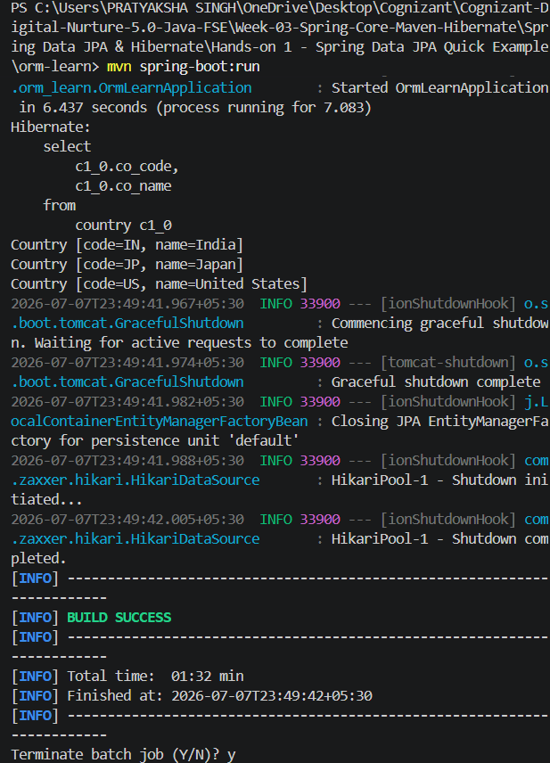

# Hands-on 1 - Spring Data JPA Quick Example

## Objective

Develop a simple Spring Boot application using Spring Data JPA and Hibernate to connect to a MySQL database and retrieve records from a database table.


## Overview

This hands-on demonstrates the basic implementation of Spring Data JPA with Hibernate in a Spring Boot application. The project connects to a MySQL database, maps a Java entity to a database table, and retrieves data using the repository layer without writing SQL queries.


## Technologies Used

- Java 17
- Spring Boot
- Spring Data JPA
- Hibernate
- MySQL
- Maven
- VS Code
- Git & GitHub


## Project Structure

```
orm-learn
│
├── src
│   ├── main
│   │   ├── java
│   │   │   └── com.cognizant.ormlearn
│   │   │       ├── model
│   │   │       │   └── Country.java
│   │   │       ├── repository
│   │   │       │   └── CountryRepository.java
│   │   │       ├── service
│   │   │       │   └── CountryService.java
│   │   │       └── OrmLearnApplication.java
│   │   │
│   │   └── resources
│   │       └── application.properties
│   │
│   └── test
│
├── pom.xml
└── README.md
```


## Database Configuration

Database Name:

```
ormlearn
```

Table:

```sql
CREATE TABLE country (
    co_code VARCHAR(2) PRIMARY KEY,
    co_name VARCHAR(50)
);
```

Sample Data:

```sql
INSERT INTO country VALUES
('IN','India'),
('US','United States'),
('JP','Japan');
```


## Implementation Steps

1. Created a Spring Boot Maven project using Spring Initializr.
2. Added the required dependencies:
   - Spring Web
   - Spring Data JPA
   - MySQL Driver
   - Spring Boot DevTools
3. Created the MySQL database.
4. Created the `country` table and inserted sample records.
5. Configured database connectivity in `application.properties`.
6. Created the `Country` entity using JPA annotations.
7. Created the `CountryRepository` interface extending `JpaRepository`.
8. Implemented the `CountryService` class.
9. Modified the main application to fetch and display all countries.
10. Successfully executed the application.


## Output

The application successfully retrieved the records stored in the MySQL database.

```
Country [code=IN, name=India]
Country [code=JP, name=Japan]
Country [code=US, name=United States]
```



## Key Concepts Learned

- Spring Boot Project Structure
- Spring Data JPA
- Hibernate ORM
- Entity Mapping
- Repository Pattern
- Dependency Injection
- Database Connectivity
- MySQL Integration
- CRUD Repository
- JPA Annotations


## Learning Outcome

By completing this hands-on, I learned how to:

- Build a Spring Boot application using Maven.
- Connect a Spring Boot application to a MySQL database.
- Map Java classes to database tables using JPA annotations.
- Use Spring Data JPA repositories for database operations.
- Retrieve records without writing SQL queries.
- Integrate Hibernate with Spring Boot for ORM.


## Author

**Pratyaksha Singh**

Cognizant Digital Nurture 5.0 – Java FSE