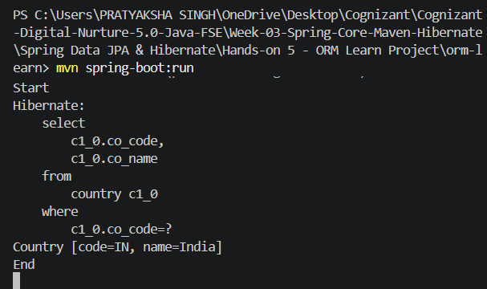
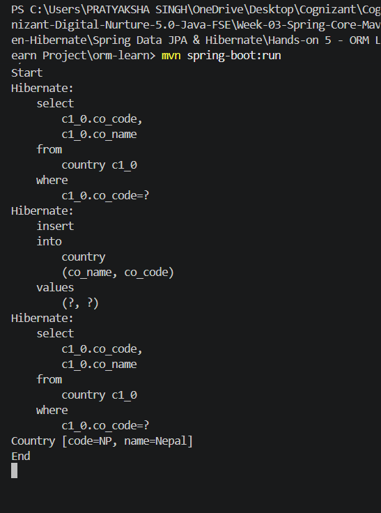
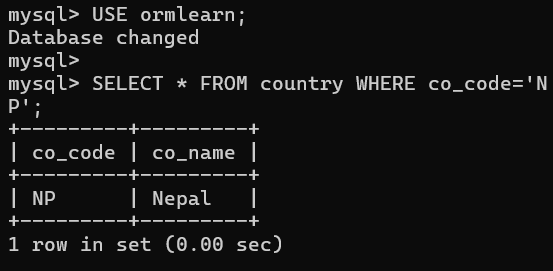
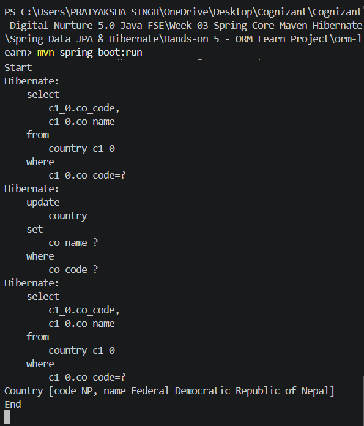
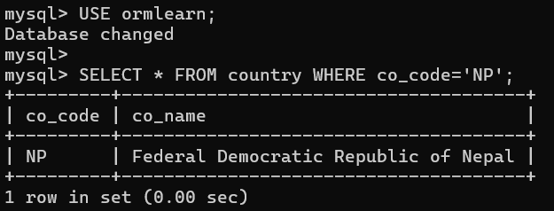
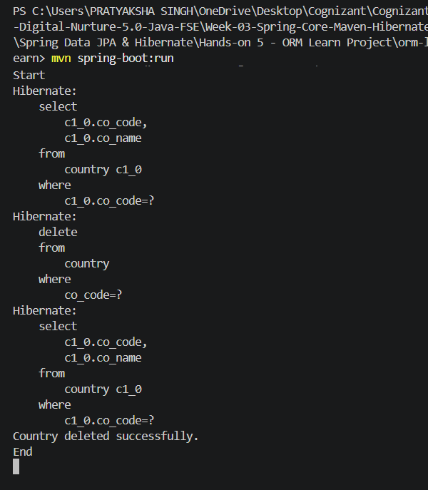
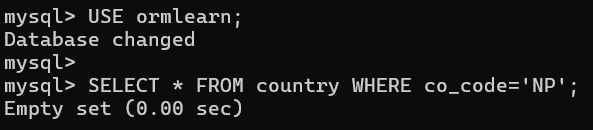
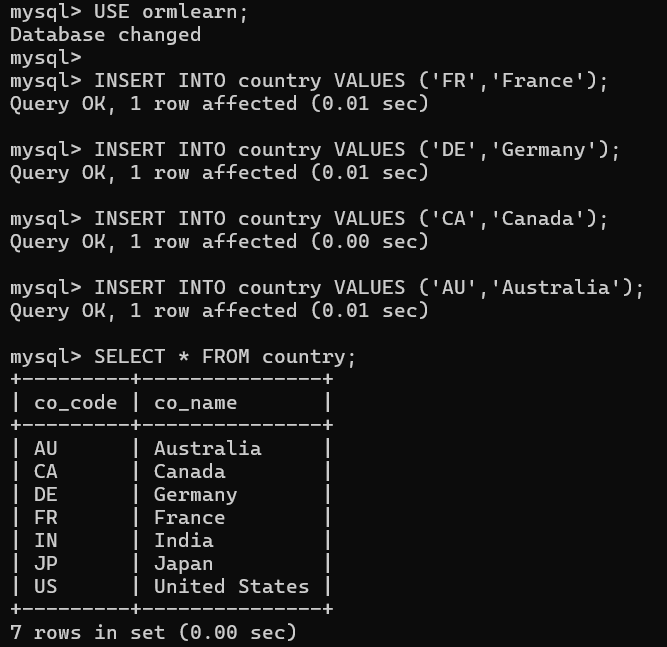
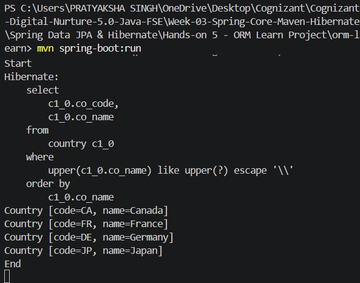

# Hands-on 5 - ORM Learn Project (Spring Data JPA & Hibernate)

## Objective

Develop a Spring Boot application using Spring Data JPA and Hibernate to perform CRUD operations on a MySQL database. The application demonstrates entity mapping, repository management, service layer implementation, transaction management, and query methods provided by Spring Data JPA.


## Technologies Used

- Java 17
- Spring Boot
- Spring Data JPA
- Hibernate ORM
- MySQL
- Maven
- VS Code
- Git & GitHub


## Project Structure

```text
orm-learn
│
├── src
│   ├── main
│   │   ├── java
│   │   │   └── com.cognizant.ormlearn
│   │   │       ├── model
│   │   │       │   └── Country.java
│   │   │       ├── repository
│   │   │       │   └── CountryRepository.java
│   │   │       ├── service
│   │   │       │   ├── CountryService.java
│   │   │       │   └── exception
│   │   │       │       └── CountryNotFoundException.java
│   │   │       └── OrmLearnApplication.java
│   │   │
│   │   └── resources
│   │       └── application.properties
│   │
│   └── test
│
├── pom.xml
└── README.md
```


## Database Configuration

Database Name

```text
ormlearn
```

Table

```sql
CREATE TABLE country (
    co_code VARCHAR(2) PRIMARY KEY,
    co_name VARCHAR(50)
);
```


## Features Implemented

- Retrieve all countries
- Find a country using country code
- Add a new country
- Update an existing country
- Delete a country
- Search countries using partial country name
- Transaction management using `@Transactional`
- Exception handling using custom exception
- Spring Data JPA Query Methods


# Outputs

## 1. Find Country by Code

Successfully fetched the country using its country code.

### Application Output




## 2. Add New Country

Added a new country (`NP - Nepal`) into the database.

### Application Output



### Database Verification



## 3. Update Country

Updated the country name from **Nepal** to **Federal Democratic Republic of Nepal**.

### Application Output



### Database Verification




## 4. Delete Country

Deleted the previously added country from the database.

### Application Output



### Database Verification




## 5. Search Countries by Partial Name

Inserted additional countries for testing and searched countries using a partial name through a Spring Data JPA Query Method.

### Database Preparation



### Application Output



## Spring Data JPA Concepts Covered

- Spring Boot Project Configuration
- Entity Mapping (`@Entity`, `@Table`, `@Id`, `@Column`)
- Repository Pattern
- JpaRepository
- Dependency Injection (`@Autowired`)
- Service Layer
- Transaction Management (`@Transactional`)
- Custom Exception Handling
- CRUD Operations
- Query Methods
- Hibernate ORM
- MySQL Integration


## Learning Outcomes

After completing this hands-on, I learned how to:

- Configure Spring Boot with Spring Data JPA.
- Connect Spring Boot to a MySQL database.
- Map Java classes to relational database tables.
- Perform CRUD operations using `JpaRepository`.
- Implement service-layer business logic.
- Handle exceptions using custom exception classes.
- Use Spring Data JPA Query Methods for searching records.
- Manage transactions using `@Transactional`.
- Verify application behavior using MySQL database queries.


## Author

**Pratyaksha Singh**

Cognizant Digital Nurture 5.0 – Java FSE