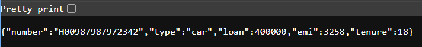
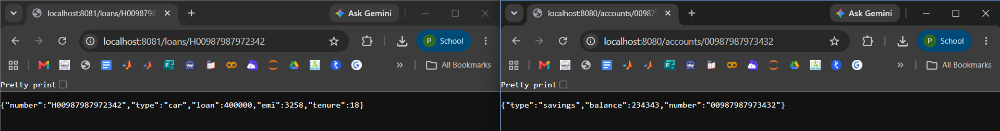

# Microservices

## Overview

This module demonstrates the implementation of basic **Microservices** using **Spring Boot 3**. Two independent RESTful services were created:

- **Account Microservice**
- **Loan Microservice**

Each service runs independently on a separate port and exposes its own REST endpoint.


## Technologies Used

- Java
- Spring Boot 3
- Spring Web
- Spring Boot DevTools
- Maven
- REST API


## Project Structure

```
Microservices
│
├── Account Microservices
│   └── account
│
├── Loan Microservices
│   └── loan
│
├── output1.png
├── output2.png
├── output3.png
└── README.md
```


# Account Microservice

### Endpoint

```
GET /accounts/{number}
```

### Sample Request

```
http://localhost:8080/accounts/00987987973432
```

### Sample Response

```json
{
  "number": "00987987973432",
  "type": "savings",
  "balance": 234343
}
```


# Loan Microservice

### Endpoint

```
GET /loans/{number}
```

### Sample Request

```
http://localhost:8081/loans/H00987987972342
```

### Sample Response

```json
{
  "number": "H00987987972342",
  "type": "car",
  "loan": 400000,
  "emi": 3258,
  "tenure": 18
}
```


# Running the Projects

## Account Microservice

```bash
cd account
mvn spring-boot:run
```

Runs on:

```
http://localhost:8080
```


## Loan Microservice

```bash
cd loan
mvn spring-boot:run
```

Runs on:

```
http://localhost:8081
```


# Output Screenshots

## Output 1 – Account Microservice


## Output 2 – Loan Microservice




## Output 3 – Both Microservices Running Simultaneously



# Learning Outcomes

- Developed independent Spring Boot microservices.
- Implemented REST APIs using `@RestController` and `@GetMapping`.
- Used path variables to fetch resource details.
- Configured multiple Spring Boot applications to run on different ports.
- Tested REST endpoints successfully using a web browser.


## Conclusion

The mandatory Microservices hands-on was successfully completed by developing two independent Spring Boot applications for **Account** and **Loan** services. Both applications were executed simultaneously on different ports and their REST APIs were tested successfully.