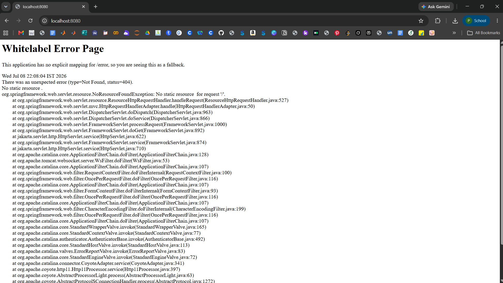
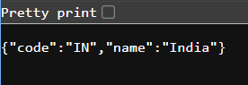
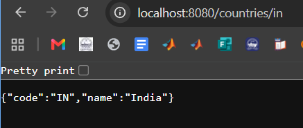
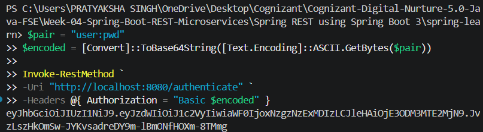

# Spring REST using Spring Boot 3

## Overview

This module demonstrates the implementation of RESTful Web Services using **Spring Boot 3**. The project covers creating REST APIs, loading Spring beans from XML configuration, retrieving country details using REST endpoints, and implementing JWT-based authentication using Spring Security.


## Technologies Used

- Java 17
- Spring Boot 3
- Spring Web
- Spring Security
- Spring Boot DevTools
- Maven
- JWT (JJWT 0.11.5)


## Project Structure

```
Spring REST using Spring Boot 3
│
├── spring-learn
├── output1.png
├── output2.png
├── output3.png
├── output4.png
├── output5.png
└── README.md
```


# Hands-on 1 – Spring Boot Project

Created a Spring Boot application using Spring Initializr and verified successful execution.

### Output




# Hands-on 2 – Load Country from Spring XML

Loaded the Country bean from `country.xml` using `ApplicationContext`.

### Endpoint

```
GET /country
```

### URL

```
http://localhost:8080/country
```

### Response

```json
{
  "code": "IN",
  "name": "India"
}
```

### Output




# Hands-on 3 – Hello World REST API

Created a simple REST endpoint.

### Endpoint

```
GET /hello
```

### URL

```
http://localhost:8080/hello
```

### Response

```
Hello World!!
```

### Output


# Hands-on 4 – Get Country by Country Code

Implemented REST endpoint using Path Variable.

### Endpoint

```
GET /countries/{code}
```

### URL

```
http://localhost:8080/countries/in
```

### Response

```json
{
  "code": "IN",
  "name": "India"
}
```

### Output




# Hands-on 5 – JWT Authentication

Configured Spring Security with Basic Authentication and implemented a JWT Authentication Service.

### Endpoint

```
GET /authenticate
```

### Authentication

```
Username : user
Password : pwd
```

### Response

Returns a JWT token after successful authentication.

### Output




# REST APIs Implemented

| Method | Endpoint | Description |
|----------|----------------|------------------------------|
| GET | `/hello` | Returns Hello World message |
| GET | `/country` | Returns country details |
| GET | `/countries/{code}` | Returns country using country code |
| GET | `/authenticate` | Returns JWT token |


# Learning Outcomes

- Developed REST APIs using Spring Boot.
- Loaded Spring beans from XML configuration.
- Used `@RestController` and `@GetMapping`.
- Implemented Path Variables.
- Configured Spring Security.
- Implemented Basic Authentication.
- Generated JWT tokens using JJWT.
- Tested REST APIs successfully.


# Conclusion

Successfully completed the mandatory Spring REST hands-ons by implementing RESTful Web Services, XML bean configuration, Spring Security, and JWT-based authentication using Spring Boot 3.