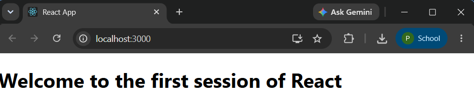

# Exercise 1 - React Setup

## Objective

Create a React application named **myfirstreact** and display the message:

> **Welcome to the first session of React**

This exercise demonstrates the basic setup of a React application using Create React App.


## Project Structure

```
Exercise-01-React-Setup/
│
├── myfirstreact/
│   ├── public/
│   ├── src/
│   │   ├── App.js
│   │   ├── App.css
│   │   ├── index.js
│   │   └── index.css
│   ├── package.json
│   ├── package-lock.json
│   └── .gitignore
│
├── output.png
└── README.md
```


## Technologies Used

- React
- JavaScript (ES6)
- Node.js
- npm
- Create React App
- Visual Studio Code


## Prerequisites

- Node.js
- npm
- Visual Studio Code


## Steps Performed

1. Created a React application using Create React App.
2. Opened the project in Visual Studio Code.
3. Modified `App.js`.
4. Displayed the heading:
   - **Welcome to the first session of React**
5. Executed the application using:

```bash
npm start
```

6. Verified the output in the browser.


## Output




## Learning Outcome

- Understood the basic React project structure.
- Learned how to create a React application using Create React App.
- Learned how to modify and execute a React application.