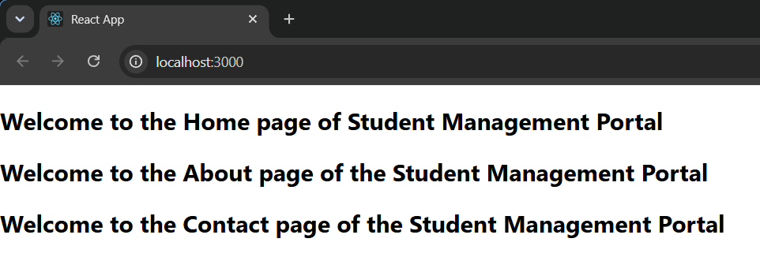

# Exercise 2 - React Components

## Objective

Develop a React application named **StudentApp** using class components to demonstrate component creation, rendering, and composition.

## Problem Statement

Create three class components:

- Home
- About
- Contact

Each component should display its respective welcome message, and all three components should be rendered in the main application.

## Project Structure

```text
Exercise-02-React-Components/
│
├── studentapp/
│   ├── public/
│   ├── src/
│   │   ├── Components/
│   │   │   ├── Home.js
│   │   │   ├── About.js
│   │   │   └── Contact.js
│   │   ├── App.js
│   │   ├── index.js
│   │   ├── App.css
│   │   └── index.css
│   ├── package.json
│   ├── package-lock.json
│   └── .gitignore
│
├── output.png
└── README.md
```

## Technologies Used

- React
- JavaScript (ES6)
- Node.js
- npm
- Create React App
- Visual Studio Code

## Prerequisites

- Node.js
- npm
- Visual Studio Code

## Components

### Home

Displays the welcome message for the Home page.

### About

Displays the welcome message for the About page.

### Contact

Displays the welcome message for the Contact page.

## Steps Performed

1. Created a React application named `studentapp`.
2. Created a `Components` folder inside the `src` directory.
3. Developed three class components:
   - Home
   - About
   - Contact
4. Imported all components into `App.js`.
5. Rendered all three components in the application.
6. Executed the application using:

```bash
npm start
```

7. Verified the output in the browser.

## Output



## Learning Outcome

- Learned how to create and organize React class components.
- Understood component composition in React.
- Practiced importing and rendering multiple components.
- Gained familiarity with the basic React project structure.