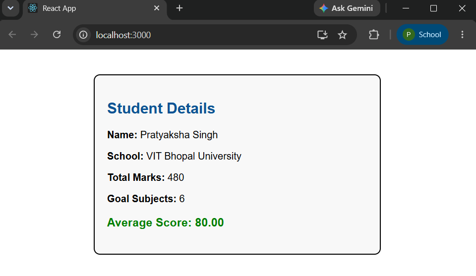

# Exercise 3 - Functional Components and Styling

## Objective

Develop a React application named **scorecalculatorapp** using a functional component to calculate and display a student's average score. Apply external CSS styling to enhance the user interface.

## Problem Statement

Create a functional component named **CalculateScore** that accepts the following properties:

- Name
- School
- Total Marks
- Goal Subjects

Calculate and display the average score along with the student details using props and external CSS.

## Project Structure

```text
Exercise-03-Functional-Components/
│
├── scorecalculatorapp/
│   ├── public/
│   ├── src/
│   │   ├── Components/
│   │   │   └── CalculateScore.js
│   │   ├── Stylesheets/
│   │   │   └── mystyle.css
│   │   ├── App.js
│   │   ├── index.js
│   │   ├── App.css
│   │   └── index.css
│   ├── package.json
│   ├── package-lock.json
│   └── .gitignore
│
├── output.png
└── README.md
```

## Technologies Used

- React
- JavaScript (ES6)
- CSS
- Node.js
- npm
- Create React App
- Visual Studio Code

## Prerequisites

- Node.js
- npm
- Visual Studio Code

## Features

- Functional React Component
- Props-based data passing
- Average score calculation
- External CSS styling
- Responsive and clean UI

## Steps Performed

1. Created a React application named `scorecalculatorapp`.
2. Created a functional component named `CalculateScore`.
3. Passed student information using React props.
4. Calculated the average score.
5. Styled the component using an external CSS file.
6. Executed the application using:

```bash
npm start
```

7. Verified the output in the browser.

## Output



## Learning Outcome

- Learned to create functional React components.
- Understood how to pass data using props.
- Implemented simple calculations inside React components.
- Applied external CSS for component styling.
- Improved understanding of component-based UI development.