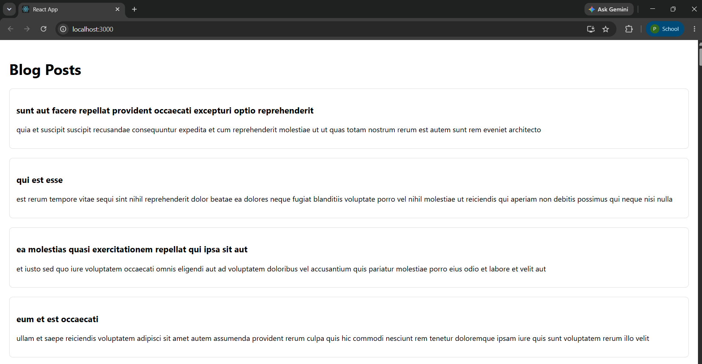

# Exercise 4 - React Component Lifecycle

## Objective

Develop a React application named **blogapp** to demonstrate React class component lifecycle methods by retrieving blog posts from a REST API and displaying them dynamically.

## Problem Statement

Create a class component named **Posts** that fetches blog post data from the JSONPlaceholder REST API using the `componentDidMount()` lifecycle method. Handle runtime errors using `componentDidCatch()` and display the retrieved posts on the webpage.

## Project Structure

```text
Exercise-04-Lifecycle/
│
├── blogapp/
│   ├── public/
│   ├── src/
│   │   ├── Post.js
│   │   ├── Posts.js
│   │   ├── App.js
│   │   ├── index.js
│   │   ├── App.css
│   │   └── index.css
│   ├── package.json
│   ├── package-lock.json
│   └── .gitignore
│
├── output.png
└── README.md
```

## Technologies Used

- React
- JavaScript (ES6)
- Fetch API
- REST API
- Node.js
- npm
- Create React App
- Visual Studio Code

## Prerequisites

- Node.js
- npm
- Visual Studio Code

## Features

- Class-based React component
- React Lifecycle Methods
- REST API integration using Fetch API
- Dynamic rendering of blog posts
- Basic error handling using `componentDidCatch()`

## API Used

```
https://jsonplaceholder.typicode.com/posts
```

## Steps Performed

1. Created a React application named `blogapp`.
2. Created a `Post` class to represent blog post objects.
3. Developed a `Posts` class component.
4. Retrieved blog posts using the Fetch API.
5. Implemented `componentDidMount()` to fetch data after component rendering.
6. Implemented `componentDidCatch()` for error handling.
7. Displayed the title and body of each blog post dynamically.
8. Executed the application using:

```bash
npm start
```

9. Verified the output in the browser.

## Output



## Learning Outcome

- Learned the React component lifecycle.
- Understood the purpose of `componentDidMount()`.
- Implemented asynchronous data fetching using the Fetch API.
- Learned how to render dynamic data using React state.
- Implemented basic error handling with `componentDidCatch()`.