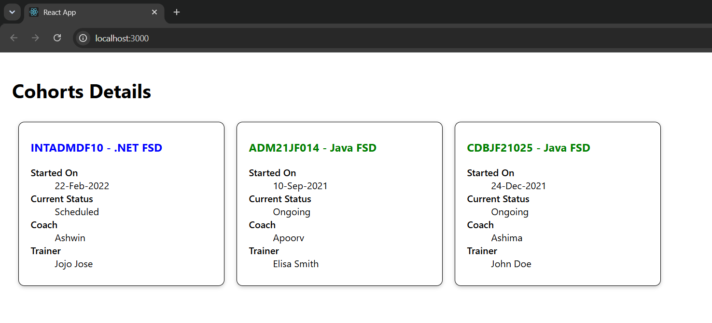

# Exercise 5 - React Styling using CSS Modules

## Objective

Develop a React application to demonstrate component styling using **CSS Modules** and **conditional styling** based on the status of each cohort.

## Problem Statement

Create a React application that displays multiple cohort details using reusable components. Style each cohort card using CSS Modules and apply different text colors depending on the cohort status.

## Project Structure

```text
Exercise-05-Styling/
│
├── cohorttracker/
│   ├── public/
│   ├── src/
│   │   ├── Components/
│   │   │   ├── CohortDetails.js
│   │   │   └── CohortDetails.module.css
│   │   ├── App.js
│   │   ├── index.js
│   │   ├── App.css
│   │   └── index.css
│   ├── package.json
│   ├── package-lock.json
│   └── .gitignore
│
├── output.png
└── README.md
```

## Technologies Used

- React
- JavaScript (ES6)
- CSS Modules
- Node.js
- npm
- Create React App
- Visual Studio Code

## Prerequisites

- Node.js
- npm
- Visual Studio Code

## Features

- Reusable React components
- CSS Module based styling
- Conditional text coloring
- Responsive card layout
- Dynamic rendering using arrays

## Styling Implemented

- CSS Modules
- `className` property
- Conditional styling based on cohort status
- Card layout with borders and rounded corners
- Box shadow for improved appearance

## Steps Performed

1. Created a React application named `cohorttracker`.
2. Created a reusable `CohortDetails` component.
3. Created a CSS Module named `CohortDetails.module.css`.
4. Styled each cohort card using CSS Modules.
5. Applied conditional colors:
   - Green for **Ongoing**
   - Blue for **Scheduled**
6. Rendered multiple cohort cards using an array of objects.
7. Executed the application using:

```bash
npm start
```

8. Verified the output in the browser.

## Output



## Learning Outcome

- Learned to use CSS Modules in React.
- Understood component-specific styling.
- Applied conditional styling using React.
- Developed reusable UI components.
- Improved knowledge of React component organization.