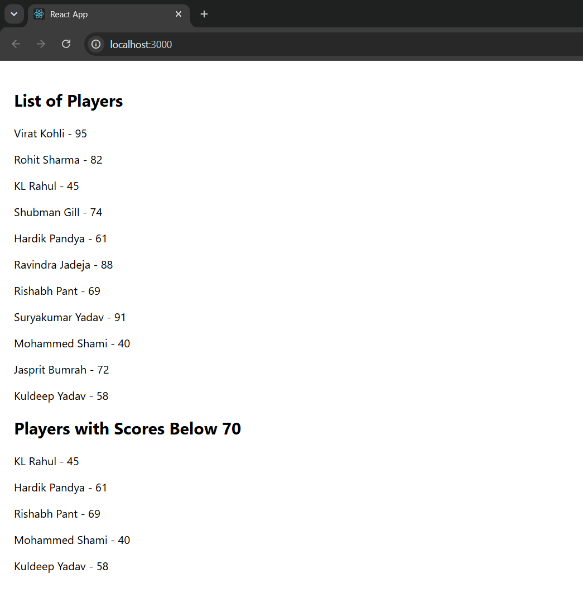
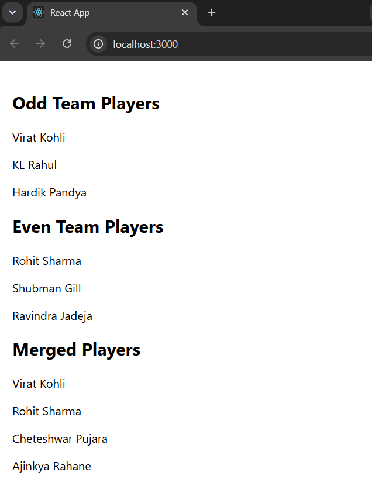

# Exercise 9 - ES6 Features in React

## Objective

Develop a React application to demonstrate the use of modern ES6 features including `map()`, arrow functions, destructuring, spread operator, and conditional rendering.

## Problem Statement

Create a React application named **cricketapp** with two components:

- ListOfPlayers
- IndianPlayers

Implement the following:

- Display player details using `map()`.
- Filter players scoring below 70 using arrow functions.
- Display odd and even team players.
- Merge two arrays using the spread operator.
- Render components conditionally using a flag.

## Project Structure

```text
Exercise-09-ES6/
│
├── cricketapp/
│   ├── public/
│   ├── src/
│   │   ├── Components/
│   │   │   ├── IndianPlayers.js
│   │   │   └── ListOfPlayers.js
│   │   ├── App.js
│   │   ├── index.js
│   │   ├── App.css
│   │   └── index.css
│   ├── package.json
│   ├── package-lock.json
│   └── .gitignore
│
├── output1.png
├── output2.png
└── README.md
```

## Technologies Used

- React
- JavaScript (ES6)
- Node.js
- npm
- Create React App
- Visual Studio Code

## Prerequisites

- Node.js
- npm
- Visual Studio Code

## ES6 Features Implemented

- Array `map()`
- Arrow Functions
- Array `filter()`
- Destructuring Concept
- Spread Operator
- Conditional Rendering

## Components

### ListOfPlayers

- Displays all player details.
- Filters and displays players with scores below 70.

### IndianPlayers

- Displays odd team players.
- Displays even team players.
- Merges T20 and Ranji Trophy player arrays using the spread operator.

## Steps Performed

1. Created a React application named `cricketapp`.
2. Created `ListOfPlayers` and `IndianPlayers` components.
3. Displayed player data using `map()`.
4. Filtered players using arrow functions.
5. Implemented odd-even player separation.
6. Merged arrays using the spread operator.
7. Used conditional rendering based on a flag variable.
8. Executed the application using:

```bash
npm start
```

9. Verified both outputs by changing the flag value.

## Output (Flag = true)



## Output (Flag = false)



## Learning Outcome

- Learned modern ES6 syntax in React.
- Practiced array operations using `map()` and `filter()`.
- Understood arrow functions and the spread operator.
- Implemented conditional rendering.
- Improved understanding of reusable React components.