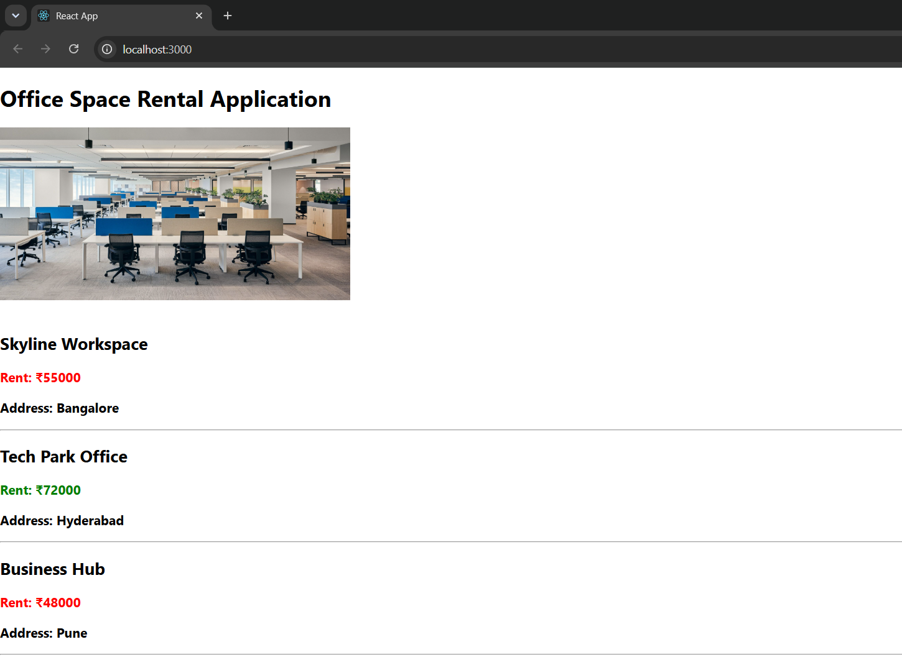

# Exercise 10 - JSX

## Objective

Develop a React application named **officespacerentalapp** to demonstrate the use of JSX, rendering objects, displaying images, inline CSS styling, and conditional rendering based on office rent.

## Problem Statement

Create a React application that displays office space details including an office image, office name, rent, and address. Display the rent in **red** when it is below ₹60,000 and **green** when it is ₹60,000 or above.

## Project Structure

```text
Exercise-10-JSX/
│
├── officespacerentalapp/
│   ├── public/
│   ├── src/
│   │   ├── Components/
│   │   │   └── OfficeSpace.js
│   │   ├── office.jpg
│   │   ├── App.js
│   │   ├── index.js
│   │   ├── App.css
│   │   └── index.css
│   ├── package.json
│   ├── package-lock.json
│   └── .gitignore
│
├── output.png
└── README.md
```

## Technologies Used

- React
- JSX
- JavaScript (ES6)
- Node.js
- npm
- Create React App
- Visual Studio Code

## Prerequisites

- Node.js
- npm
- Visual Studio Code

## Features

- JSX syntax
- Rendering images
- Rendering arrays using `map()`
- Inline CSS styling
- Conditional color rendering
- Dynamic office details display

## Steps Performed

1. Created a React application named `officespacerentalapp`.
2. Added an office image.
3. Created an array of office objects.
4. Displayed office details using JSX.
5. Applied inline CSS to change the rent color:
   - Red for rent below ₹60,000.
   - Green for rent ₹60,000 and above.
6. Rendered all office details dynamically.
7. Executed the application using:

```bash
npm start
```

8. Verified the output in the browser.

## Output



## Learning Outcome

- Learned JSX syntax in React.
- Displayed images using JSX.
- Rendered dynamic data from arrays.
- Applied conditional inline styling.
- Improved understanding of JSX expressions and rendering.