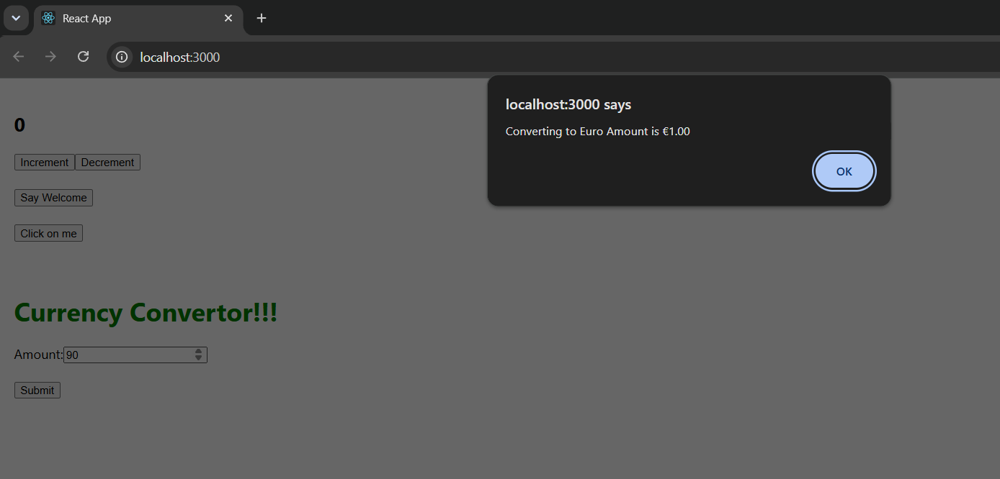

# Exercise 11 - Event Handling

## Objective

Develop a React application named **eventexamplesapp** to demonstrate React event handling, synthetic events, event handlers, and a simple currency conversion using class components.

## Problem Statement

Create a React application that demonstrates various event handling techniques by implementing:

- Increment and Decrement counter
- Multiple method invocation
- Welcome message
- Synthetic event handling
- Currency Converter using form submission

## Project Structure

```text
Exercise-11-Event-Handling/
│
├── eventexamplesapp/
│   ├── public/
│   ├── src/
│   │   ├── Components/
│   │   │   ├── Counter.js
│   │   │   └── CurrencyConvertor.js
│   │   ├── App.js
│   │   ├── index.js
│   │   ├── App.css
│   │   └── index.css
│   ├── package.json
│   ├── package-lock.json
│   └── .gitignore
│
├── output.png
└── README.md
```

## Technologies Used

- React
- JavaScript (ES6)
- Node.js
- npm
- Create React App
- Visual Studio Code

## Prerequisites

- Node.js
- npm
- Visual Studio Code

## Features

- Counter using React state
- Increment and Decrement operations
- Multiple function invocation
- Synthetic Event handling
- Form handling
- Currency conversion
- Alert messages

## Components

### Counter

- Increment counter
- Decrement counter
- Display welcome message
- Handle synthetic events

### CurrencyConvertor

- Accept amount input
- Convert Indian Rupees to Euro
- Display conversion result using an alert

## Steps Performed

1. Created a React application named `eventexamplesapp`.
2. Developed a `Counter` component.
3. Implemented Increment and Decrement functionality.
4. Invoked multiple methods from a single event.
5. Implemented synthetic event handling.
6. Developed a `CurrencyConvertor` component.
7. Converted INR to Euro using form submission.
8. Executed the application using:

```bash
npm start
```

9. Verified all event handling operations.

## Output



## Learning Outcome

- Learned React event handling.
- Understood event binding in class components.
- Implemented synthetic events.
- Practiced handling forms.
- Developed interactive React components using state and events.