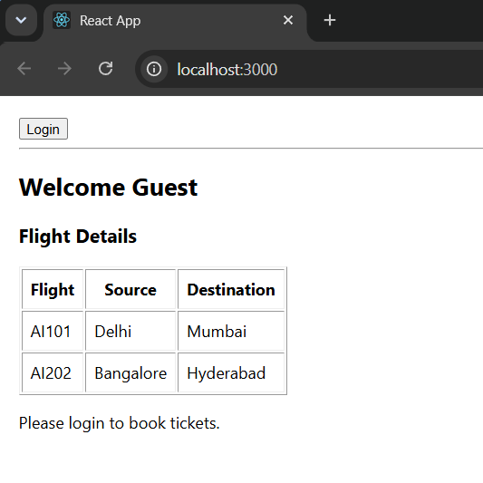
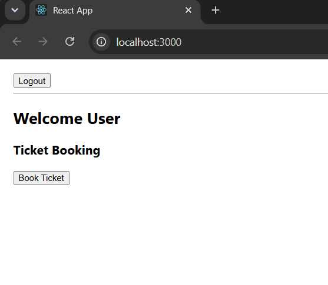

# Exercise 12 - Conditional Rendering

## Objective

Develop a React application named **ticketbookingapp** to demonstrate conditional rendering by displaying different pages for guest users and logged-in users.

## Problem Statement

Create a React application where:

- Guest users can browse available flight details.
- Logged-in users can access the ticket booking page.
- Login and Logout buttons should toggle between Guest and User pages.

## Project Structure

```text
Exercise-12-Conditional-Rendering/
│
├── ticketbookingapp/
│   ├── public/
│   ├── src/
│   │   ├── Components/
│   │   │   ├── GuestPage.js
│   │   │   ├── UserPage.js
│   │   │   └── TicketBooking.js
│   │   ├── App.js
│   │   ├── index.js
│   │   ├── App.css
│   │   └── index.css
│   ├── package.json
│   ├── package-lock.json
│   └── .gitignore
│
├── output1.png
├── output2.png
└── README.md
```

## Technologies Used

- React
- JavaScript (ES6)
- React Hooks (`useState`)
- Node.js
- npm
- Create React App
- Visual Studio Code

## Prerequisites

- Node.js
- npm
- Visual Studio Code

## Features

- Conditional Rendering
- Login / Logout functionality
- Guest and User views
- Flight details display
- Ticket booking interface
- React Hooks (`useState`)

## Components

### GuestPage

- Displays available flight details.
- Prompts the user to log in before booking tickets.

### UserPage

- Displays the ticket booking page.
- Allows the logged-in user to access booking functionality.

### TicketBooking

- Controls the login state.
- Switches between Guest and User pages using conditional rendering.

## Steps Performed

1. Created a React application named `ticketbookingapp`.
2. Developed Guest and User components.
3. Implemented login state using `useState`.
4. Used conditional rendering to display different pages.
5. Added Login and Logout functionality.
6. Executed the application using:

```bash
npm start
```

7. Verified Guest and User views.

## Output (Guest View)



## Output (User View)



## Learning Outcome

- Learned conditional rendering in React.
- Implemented state management using React Hooks.
- Understood component switching based on application state.
- Developed a simple authentication-style interface.