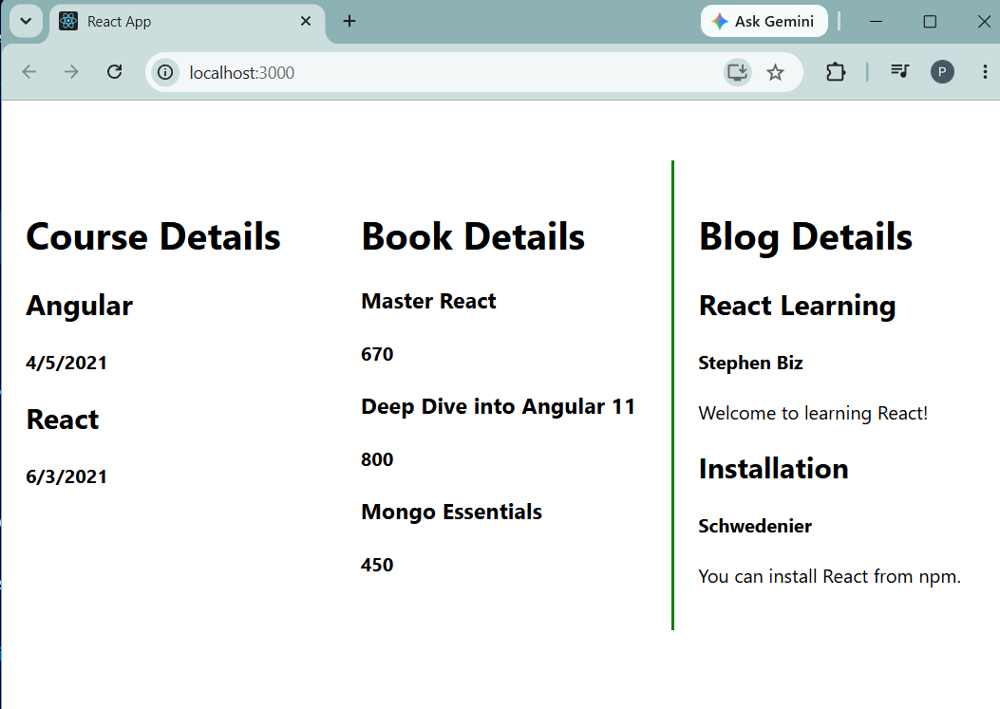

# Exercise 13 - Lists and Keys

## Objective

Develop a React application named **bloggerapp** to demonstrate rendering multiple components using React Lists, Keys, `map()` function, and conditional rendering.

## Problem Statement

Create a React application with the following components:

- Book Details
- Blog Details
- Course Details

Display all records dynamically using React lists and unique keys.

## Project Structure

```text
Exercise-13-Lists-and-Keys/
│
├── bloggerapp/
│   ├── public/
│   ├── src/
│   │   ├── Components/
│   │   │   ├── BookDetails.js
│   │   │   ├── BlogDetails.js
│   │   │   └── CourseDetails.js
│   │   ├── App.js
│   │   ├── index.js
│   │   ├── App.css
│   │   └── index.css
│   ├── package.json
│   ├── package-lock.json
│   └── .gitignore
│
├── output.png
└── README.md
```

## Technologies Used

- React
- JavaScript (ES6)
- Node.js
- npm
- Create React App
- Visual Studio Code

## Prerequisites

- Node.js
- npm
- Visual Studio Code

## Features

- React Lists
- React Keys
- Array Mapping
- Conditional Rendering
- Multiple Components
- Dynamic UI Rendering

## Components

### CourseDetails

Displays available course names and their respective dates.

### BookDetails

Displays book names and prices.

### BlogDetails

Displays blog title, author, and description.

## Steps Performed

1. Created a React application named `bloggerapp`.
2. Created CourseDetails, BookDetails, and BlogDetails components.
3. Stored data using arrays of objects.
4. Rendered data dynamically using the `map()` function.
5. Assigned unique keys to each rendered item.
6. Used conditional rendering to display components.
7. Executed the application using:

```bash
npm start
```

8. Verified the output in the browser.

## Output



## Learning Outcome

- Learned rendering lists in React.
- Understood the importance of React Keys.
- Implemented dynamic rendering using `map()`.
- Practiced component composition.
- Improved understanding of conditional rendering.