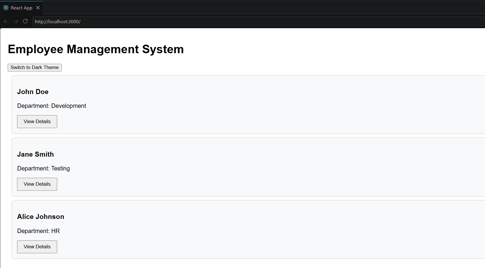
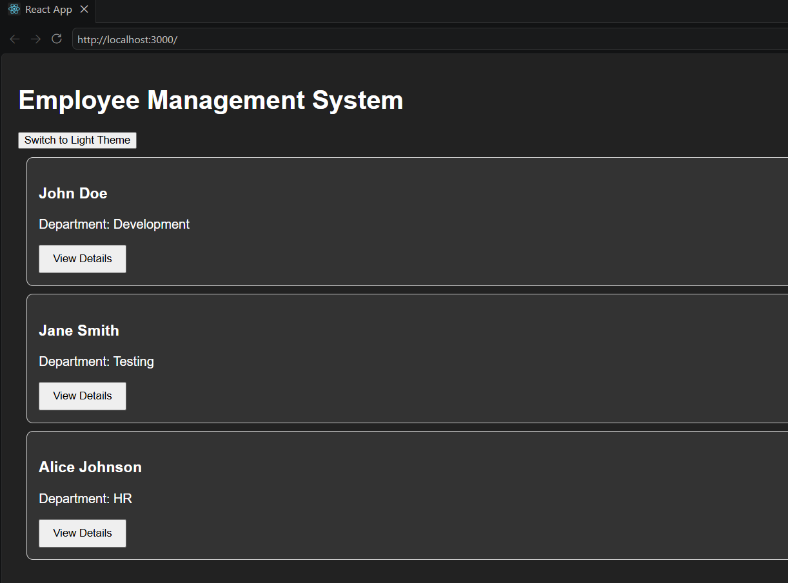

# Exercise 14 - Context API

## Objective

This exercise demonstrates the implementation of the React Context API to share data between components without prop drilling. The application allows switching between light and dark themes using a shared context.

## Prerequisites

- Node.js
- npm
- Visual Studio Code
- React

## Folder Structure

```
Exercise-14-Context-API
│
├── employeesapp
│   ├── src
│   │   ├── components
│   │   │   ├── EmployeeCard.js
│   │   │   └── EmployeeList.js
│   │   ├── ThemeContext.js
│   │   ├── App.js
│   │   ├── index.js
│   │   └── index.css
│   └── ...
├── output1.png
├── output2.png
└── README.md
```

## Features

- Created a React Context using `createContext()`.
- Implemented `ThemeContext.Provider` to share theme data.
- Consumed context using the `useContext()` hook.
- Eliminated prop drilling between components.
- Implemented light and dark theme switching.

## How to Run

```bash
npm install
npm start
```

## Output

### Light Theme



### Dark Theme



## Learning Outcomes

- Understood the purpose of the React Context API.
- Created and exported a custom context.
- Shared data across multiple components using Context Provider.
- Accessed shared data using the `useContext()` hook.
- Reduced unnecessary prop passing between parent and child components.