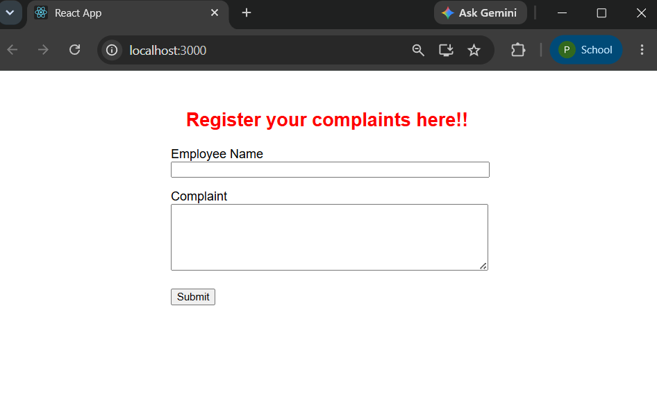
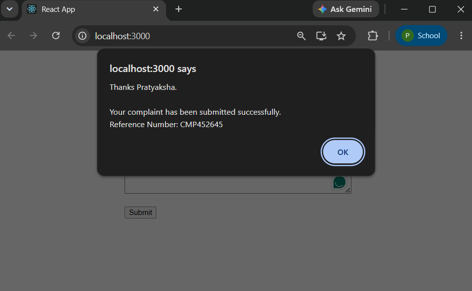

# Exercise 15 - React Forms

## Objective

This exercise demonstrates the implementation of React forms using controlled components and event handling. A complaint registration form is created to collect employee details and generate a complaint reference number upon submission.

## Prerequisites

- Node.js
- npm
- Visual Studio Code
- React

## Folder Structure

```
Exercise-15-React-Forms
│
├── ticketraisingapp
├── output1.png
├── output2.png
└── README.md
```

## Features

- Employee Name input field
- Complaint textarea
- Controlled form components
- Form submission handling
- Auto-generated complaint reference number

## How to Run

```bash
npm install
npm start
```

## Output

### Complaint Registration Form



### Complaint Submitted Successfully



## Learning Outcomes

- Created controlled form components in React.
- Managed form state using React Hooks.
- Handled form submission with event handling.
- Generated dynamic complaint reference numbers.
- Reset form fields after successful submission.