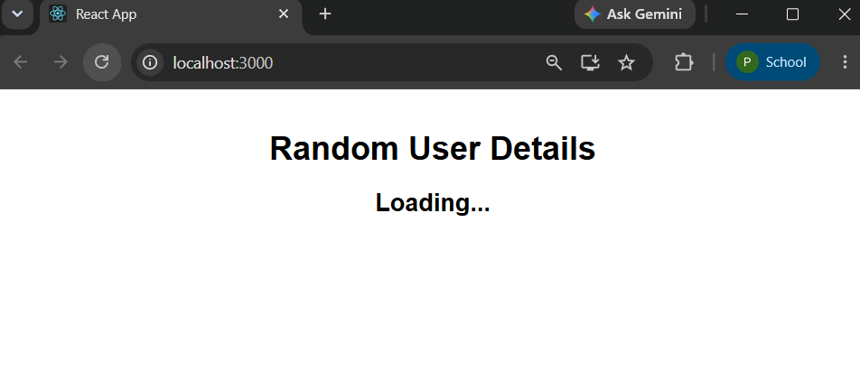
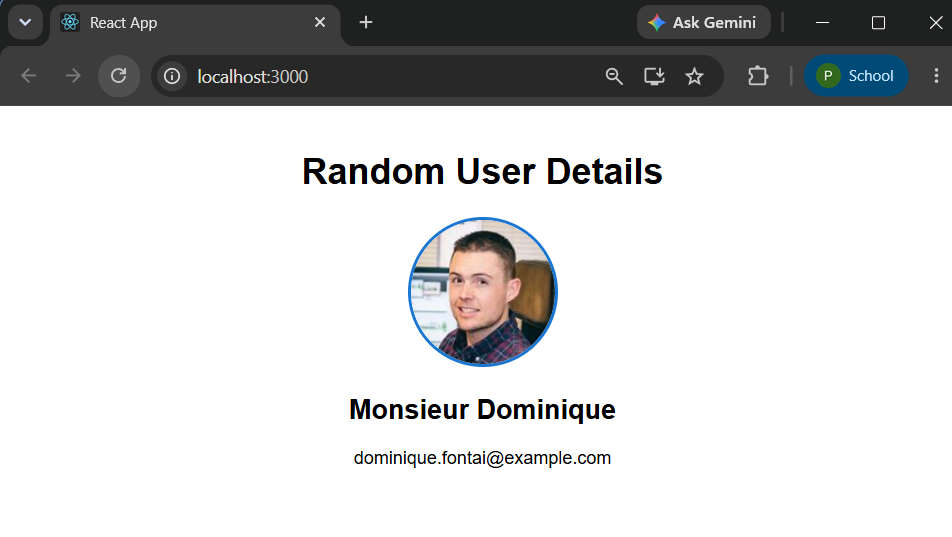

# Exercise 17 - Fetch API

## Objective

This exercise demonstrates how to consume a REST API in React using the Fetch API and display the retrieved user information.

## Prerequisites

- Node.js
- npm
- Visual Studio Code
- React

## Folder Structure

```
Exercise-17-Fetch-API
│
├── fetchuserapp
├── output1.png
├── output2.png
└── README.md
```

## Features

- Retrieves user details from the Random User API.
- Displays the user's profile picture.
- Displays the user's title and first name.
- Uses React Hooks for asynchronous data fetching.

## API Used

```
https://randomuser.me/api/
```

## How to Run

```bash
npm install
npm start
```

## Output

### Loading State



### User Details



## Learning Outcomes

- Consumed a REST API using the Fetch API.
- Managed asynchronous operations with `useEffect`.
- Stored API responses using React state.
- Rendered dynamic content from external APIs.