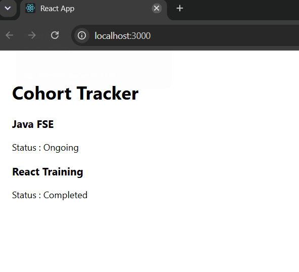
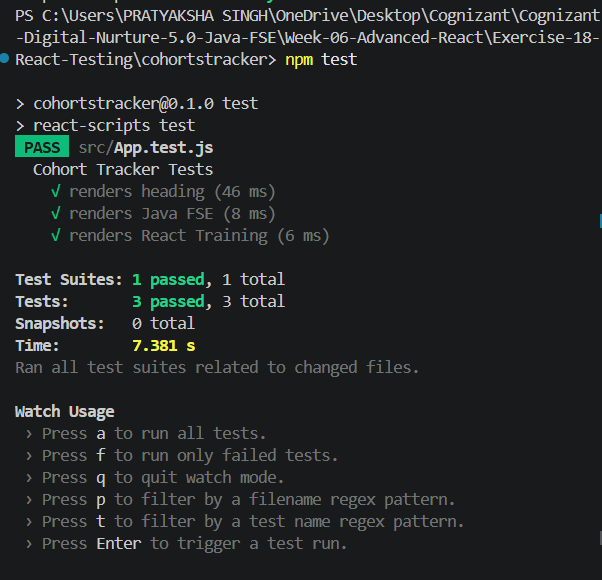

# Exercise 18 - React Testing

## Objective

This exercise demonstrates unit testing in React using Jest and React Testing Library.

## Prerequisites

- Node.js
- npm
- Visual Studio Code
- React

## Folder Structure

```
Exercise-18-React-Testing
│
├── cohortstracker
├── output1.png
├── output2.png
└── README.md
```

## Features

- Component rendering tests
- UI verification
- Jest test execution
- React Testing Library

## How to Run

```bash
npm install
npm test
```

## Output

### Application



### Test Execution



## Learning Outcomes

- Created unit tests using Jest.
- Verified component rendering.
- Used React Testing Library assertions.
- Executed automated tests successfully.