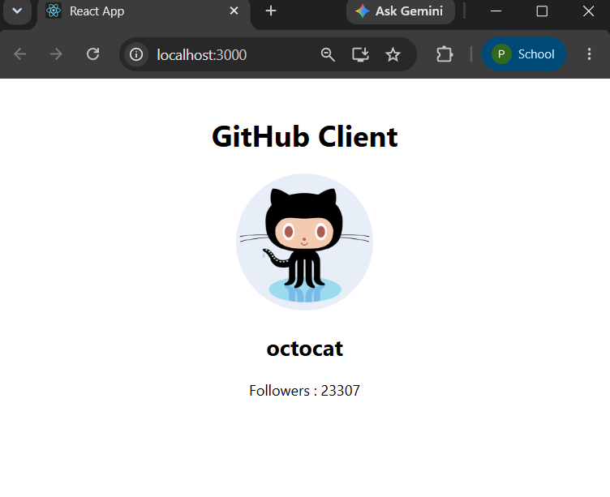
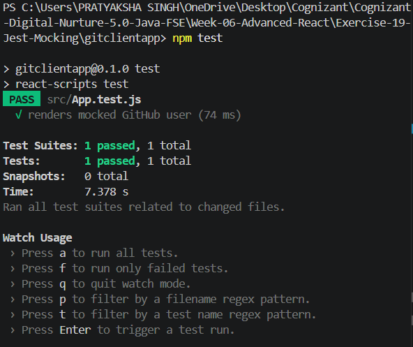

# Exercise 19 - Jest Mocking

## Objective

This exercise demonstrates API testing in React using Jest by mocking Axios requests.

## Prerequisites

- Node.js
- npm
- Visual Studio Code
- React
- Axios

## Folder Structure

```
Exercise-19-Jest-Mocking
│
├── gitclientapp
├── output1.png
├── output2.png
└── README.md
```

## Features

- Fetches GitHub user information using Axios.
- Mocks Axios API requests during testing.
- Tests React components using Jest and React Testing Library.

## How to Run

### Install dependencies

```bash
npm install
```

### Start application

```bash
npm start
```

### Execute tests

```bash
npm test
```

## Output

### Application



### Jest Test Result



## Learning Outcomes

- Consumed REST APIs using Axios.
- Mocked API responses with Jest.
- Tested React components without making real network requests.
- Verified component rendering using mocked data.