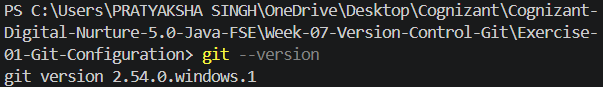
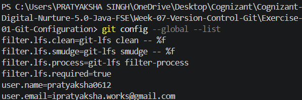
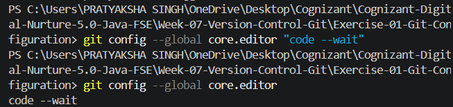
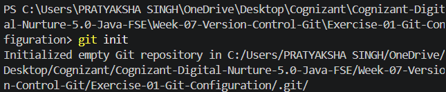
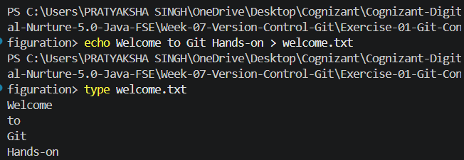
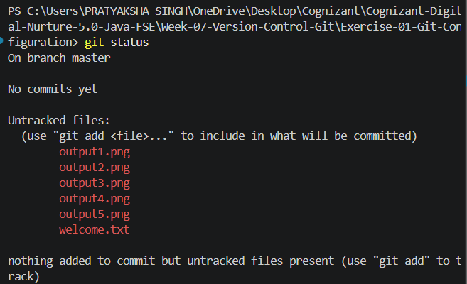
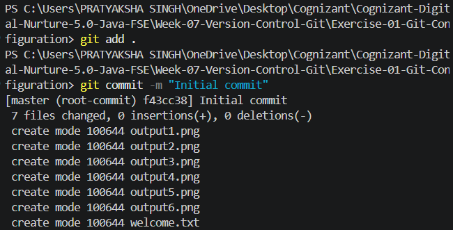
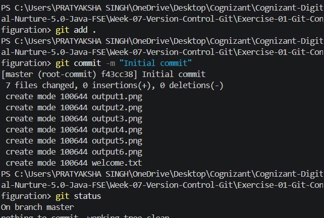

# Exercise 01 - Git Configuration

## Objective

This exercise demonstrates the basic setup and configuration of Git, including repository initialization, user configuration, staging, committing, and repository status management.

## Prerequisites

- Git for Windows
- Git Bash
- Visual Studio Code

## Folder Structure

```
Exercise-01-Git-Configuration
│
├── output1.png
├── output2.png
├── output3.png
├── output4.png
├── output5.png
├── output6.png
├── output7.png
├── output8.png
├── welcome.txt
└── README.md
```

## Commands Executed

### Verify Git Installation

```bash
git --version
```

### Configure User Details

```bash
git config --global user.name "Pratyaksha Singh"
git config --global user.email "YOUR_EMAIL"
```

### Verify Configuration

```bash
git config --global --list
```

### Configure VS Code as Default Editor

```bash
git config --global core.editor "code --wait"
```

### Verify Default Editor

```bash
git config --global core.editor
```

### Initialize Git Repository

```bash
git init
```

### Create Sample File

```bash
echo Welcome to Git Hands-on > welcome.txt
```

### Check Repository Status

```bash
git status
```

### Stage File

```bash
git add welcome.txt
```

### Commit Changes

```bash
git commit -m "Initial commit"
```

## Output

### Git Version



### Git Configuration



### VS Code Editor Configuration



### Git Repository Initialization



### Created File



### Git Status Before Staging



### Initial commit



### After commit



## Learning Outcomes

- Verified Git installation.
- Configured Git username and email.
- Configured Visual Studio Code as the default Git editor.
- Initialized a local Git repository.
- Created and tracked a new file.
- Staged changes using Git.
- Committed changes to the local repository.
- Understood the Git workflow using `git status`, `git add`, and `git commit`.