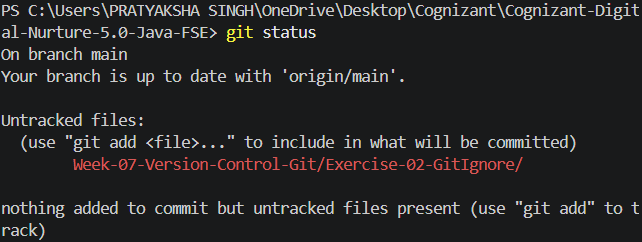
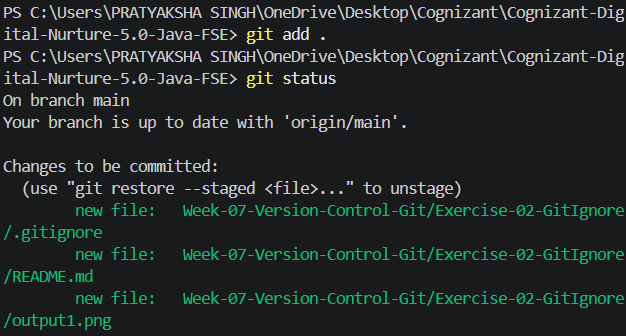
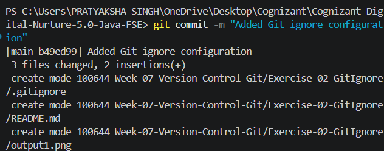

# Exercise 02 - Git Ignore

## Objective

This exercise demonstrates how to ignore unwanted files and folders from being tracked by Git using the `.gitignore` file.

## Prerequisites

- Git for Windows
- Git Bash
- Visual Studio Code
- Existing Git repository

## Folder Structure

```
Exercise-02-GitIgnore
│
├── .gitignore
├── application.log
├── error.log
├── logs
│   └── debug.log
├── output1.png
├── output2.png
├── output3.png
└── README.md
```

## Git Ignore Configuration

```gitignore
*.log
logs/
```

## Commands Executed

### Check Repository Status

```bash
git status
```

### Stage Files

```bash
git add .
```

### Verify Status

```bash
git status
```

### Commit Changes

```bash
git commit -m "Added Git ignore configuration"
```

## Output

### Repository Status Before Staging



### Repository Status After Staging



### Commit Successful



## Learning Outcomes

- Understood the purpose of the `.gitignore` file.
- Ignored files using wildcard patterns.
- Ignored complete directories from version control.
- Verified ignored files using `git status`.
- Learned how Git excludes unnecessary files from commits.