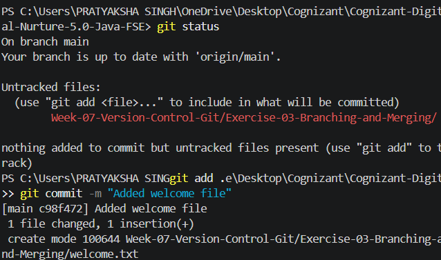
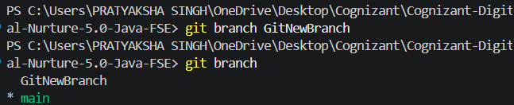
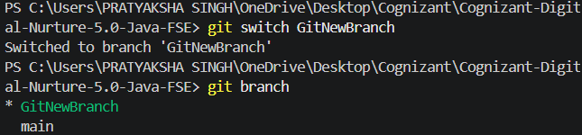
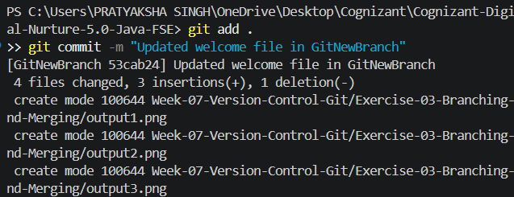
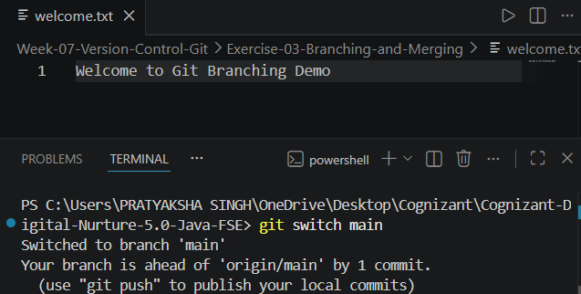
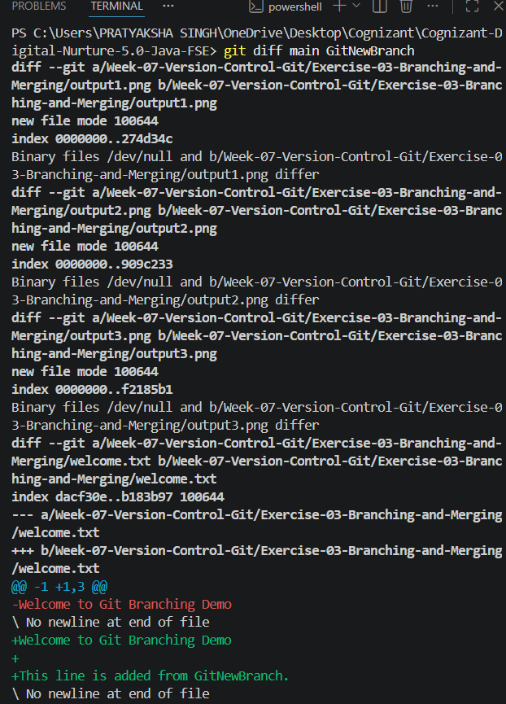
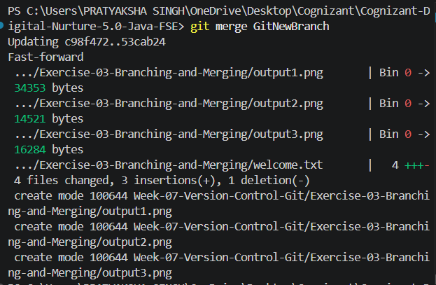
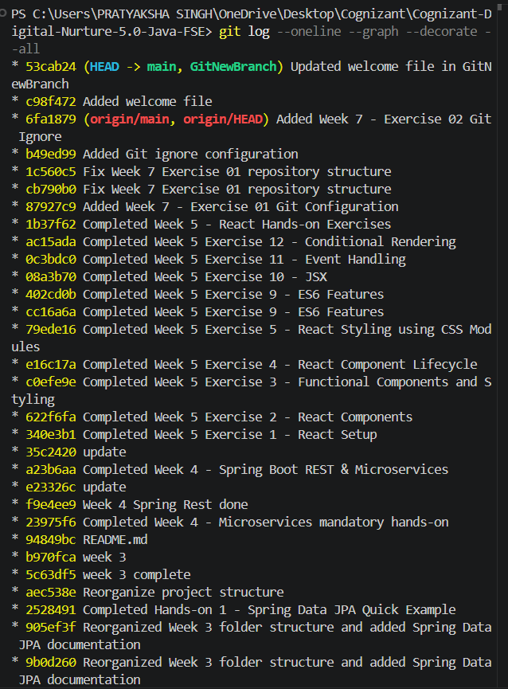
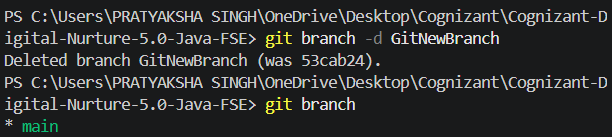

# Exercise 03 - Branching and Merging

## Objective

This exercise demonstrates the use of Git branches for parallel development and the process of merging changes back into the main branch.

## Prerequisites

- Git for Windows
- Git Bash
- Visual Studio Code
- Existing Git repository

## Folder Structure

```
Exercise-03-Branching-and-Merging
│
├── welcome.txt
├── output1.png
├── output2.png
├── output3.png
├── output4.png
├── output5.png
├── output6.png
├── output7.png
├── output8.png
├── output9.png
└── README.md
```

## Commands Executed

### Check Repository Status

```bash
git status
```

### Stage and Commit

```bash
git add .
git commit -m "Added welcome file"
```

### Create Branch

```bash
git branch GitNewBranch
```

### View Available Branches

```bash
git branch
```

### Switch to Branch

```bash
git switch GitNewBranch
```

### Commit Changes in Branch

```bash
git add .
git commit -m "Updated welcome file in GitNewBranch"
```

### Switch Back to Main Branch

```bash
git switch main
```

### Compare Branches

```bash
git diff main GitNewBranch
```

### Merge Branch

```bash
git merge GitNewBranch
```

### View Commit History

```bash
git log --oneline --graph --decorate --all
```

### Delete Branch

```bash
git branch -d GitNewBranch
```

## Output

### Initial Commit



### Branch Creation



### Switched to New Branch



### Commit on Feature Branch



### Main Branch Before Merge



### Difference Between Branches



### Successful Merge



### Git Commit History



### Branch Deleted



## Learning Outcomes

- Created and managed Git branches.
- Switched between multiple branches.
- Committed changes independently in a feature branch.
- Compared differences between branches.
- Merged changes into the main branch.
- Visualized commit history using Git log.
- Deleted merged branches to maintain a clean repository.