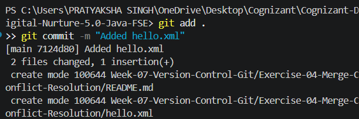
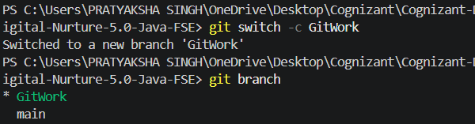
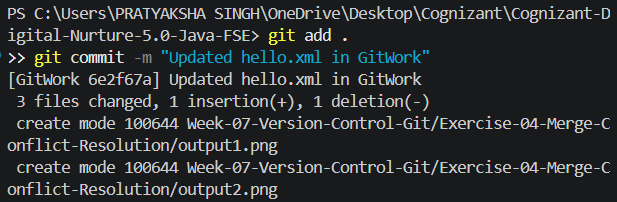
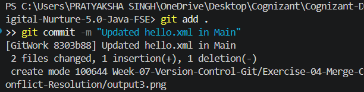

# Exercise 04 - Merge Conflict Resolution

## Objective

This exercise demonstrates the Git merge process and explains how merge conflicts occur when the same section of a file is modified in different branches.

## Prerequisites

- Git for Windows
- Git Bash
- Visual Studio Code
- Existing Git repository

## Folder Structure

```
Exercise-04-Merge-Conflict-Resolution
│
├── hello.xml
├── output1.png
├── output2.png
├── output3.png
├── output4.png
└── README.md
```

## Commands Executed

### Create Feature Branch

```bash
git switch -c GitWork
```

### Commit Changes

```bash
git add .
git commit -m "Updated hello.xml in GitWork"
```

### Switch to Main Branch

```bash
git switch main
```

### Merge Branch

```bash
git merge GitWork
```

## Output

### Initial Commit



### Branch Creation



### Commit on GitWork Branch



### Merge Result



## Note

During this exercise, Git performed a **Fast-forward merge** because there were no conflicting changes between the branches. Since the histories did not diverge, Git merged the changes automatically without requiring manual conflict resolution.

## Learning Outcomes

- Created a feature branch.
- Committed changes in a separate branch.
- Switched between branches.
- Merged branches successfully.
- Understood the conditions under which Git performs a Fast-forward merge.
- Learned when merge conflicts occur and when Git can merge automatically.