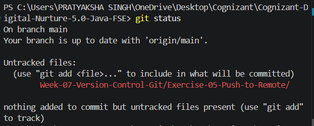
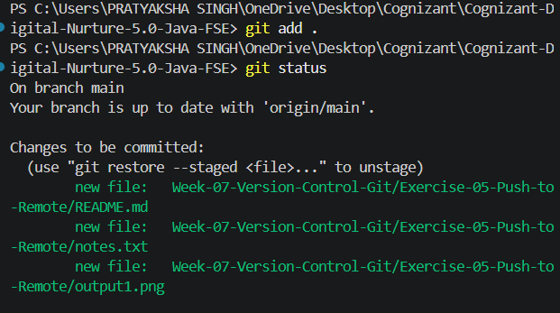
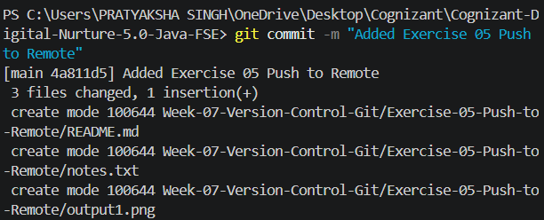
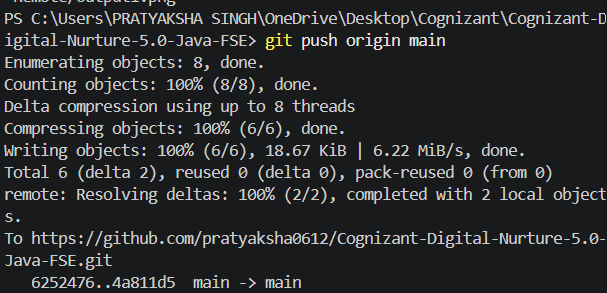

# Exercise 05 - Push to Remote Repository

## Objective

This exercise demonstrates how to push committed changes from a local Git repository to a remote GitHub repository.

## Prerequisites

- Git for Windows
- Git Bash
- Visual Studio Code
- GitHub account
- Existing Git repository

## Folder Structure

```
Exercise-05-Push-to-Remote
│
├── notes.txt
├── output1.png
├── output2.png
├── output3.png
├── output4.png
└── README.md
```

## Commands Executed

### Check Repository Status

```bash
git status
```

### Stage Changes

```bash
git add .
```

### Commit Changes

```bash
git commit -m "Added Exercise 05 Push to Remote"
```

### Push to Remote Repository

```bash
git push origin main
```

## Output

### Repository Status



### Staged Changes



### Commit Successful



### Push Successful



## Learning Outcomes

- Verified repository status before pushing.
- Staged local changes.
- Created a commit with a descriptive message.
- Pushed committed changes to the remote GitHub repository.
- Understood the synchronization process between local and remote repositories.